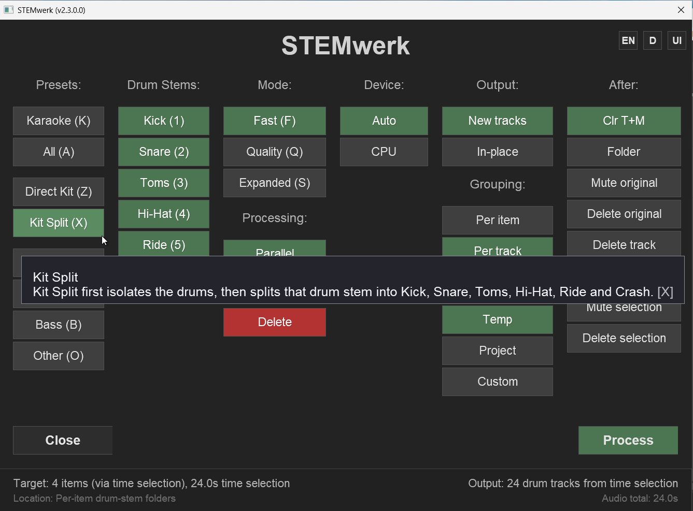
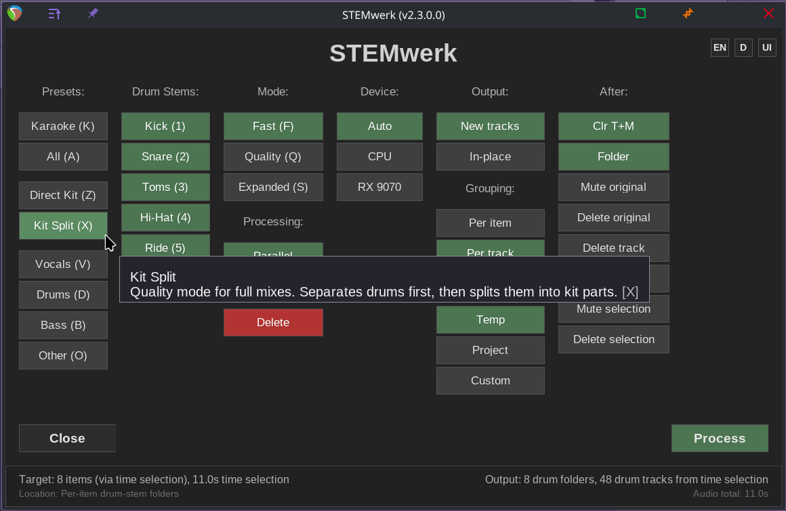
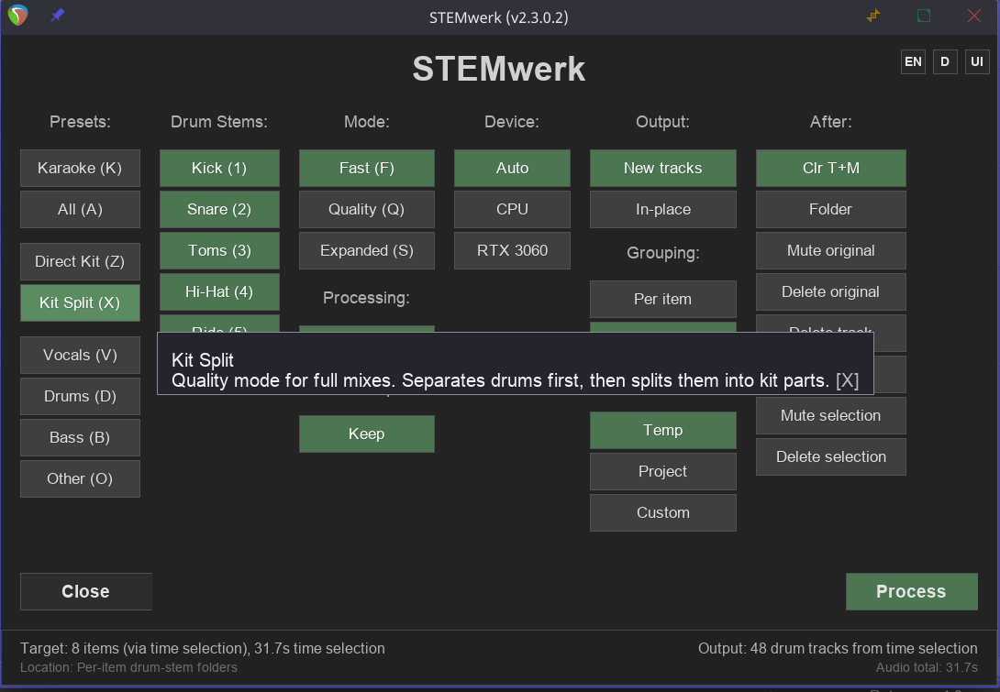
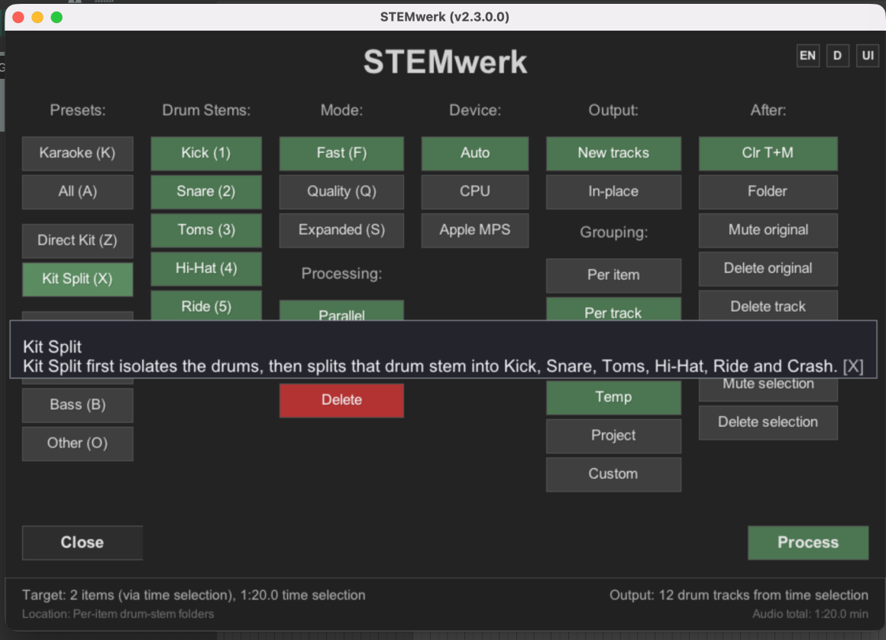

<p>
  
</p>

Local-first stem separation inside REAPER (open source, ReaPack).<br>
Split vocals, drums, bass, and more directly in your DAW for practical production, editing, remix, and karaoke workflows.

## What is STEMwerk-reaper?
STEMwerk-reaper is a REAPER script package that runs high-quality stem separation on selected items or time selections and brings the results back into your project as new tracks or in-place takes. It uses a Python backend and keeps processing on your machine.

## Release status
This README describes STEMwerk `2.3.1.1`, the current release.

- `2.3.1.1` is the current release for the 2.3 line and is published as a tagged GitHub Release.
- It carries forward the macOS online Repair introduced in the previous `2.3.1.0` release and adds the macOS Apple Silicon FFmpeg hotfix (issue #111): the bundled Apple Silicon package ships a portable arm64 FFmpeg/ffprobe, Setup no longer depends on Homebrew/MacPorts, and FFmpeg validation in Setup/Repair is fail-closed.
- The current official macOS artifacts are `STEMwerk-2.3.1.1.pkg` and `STEMwerk-2.3.1.1-bundled-apple-silicon.pkg`. The bundled artifact is runtime-only and contains no models.
- Previous release artifacts must not be treated as the current `2.3.1.1` macOS artifacts.
- `2.3.1.0` introduced macOS online Repair and moved required model installation into Setup/Repair; it is now the previous 2.3 release baseline.
- `2.3.0.7` was a ReaPack distribution hotfix on top of `2.3.0.6` (Linux ReaPack fix for the missing managed diffq wheel).
- `2.3.0.6` was a previous installer release before `2.3.1.0`.
- `2.3.0.0` is the original historical 2.3 full-release baseline.
- The ReaPack index declares `2.3.1.1`; the currently downloadable assets are on the published release page.
- GitHub Release (current): <https://github.com/flarkflarkflark/STEMwerk-reaper/releases/tag/v2.3.1.1>
- GitHub Release (previous scripts / ReaPack hotfix): <https://github.com/flarkflarkflark/STEMwerk-reaper/releases/tag/v2.3.0.7>
- GitHub Release (previous installer assets): <https://github.com/flarkflarkflark/STEMwerk-reaper/releases/tag/v2.3.0.6>
- ReaPack index: <https://raw.githubusercontent.com/flarkflarkflark/STEMwerk-reaper/main/index.xml>

For full release notes, asset checksums, and current download details, use the published GitHub Release pages.


## Historical: what was new in 2.3.0.6 / 2.3.0.7
2.3.0.6 (narrow corrective release on the official 2.3.0.4 line):
- Intel Mac Drum Kit Split crash fixed; when a kit split genuinely cannot run, STEMwerk now fails with a safe, explicit message instead of crashing.
- DrumSep / Direct Kit checkpoint resolution fixed: the audio-separator catalog checkpoint resolves to the managed canonical checkpoint and configuration; no more processing-time checkpoint alias copies.
- Verify / Check-only is strictly read-only and no longer writes to your settings.
- Auto device selection on GPU-less machines now selects the best available device instead of silently failing.
- Runtime verification imports NumPy and Numba and runs a compiled Numba JIT probe; the macOS constraints pin NumPy 1.26.4 as the numba-compatible combination.
- Apple Silicon Repair safety: Repair verifies the complete bundled recovery payload before any `.venv` rebuild cleanup; a bundled Apple Silicon installer ships as a `2.3.0.6` release asset.
- Support bundle diagnostics now include current runs, current-session evidence, and policy events.
- Various i18n corrections (including restored German umlauts).

2.3.0.7 (ReaPack distribution hotfix):
- Fixes ReaPack installs on Linux (managed Python 3.12) failing Setup/Repair with `audio_separator_install_failed`: the managed diffq wheel was missing from the ReaPack package.
- Recovery on Linux: update via ReaPack, then run `STEMwerk: Setup` → Repair once.
- No new installer assets — the `2.3.0.6` packages and checksums remain current; scripts update via ReaPack.

## Historical known issue: Apple Silicon Repair (2.3.0.6/2.3.0.7)
This issue applied to the old `2.3.0.6`/`2.3.0.7` releases and is fixed in current versions (`2.3.1.0` introduced a proper online Repair; `2.3.1.1` ships the portable arm64 FFmpeg/ffprobe payload in the bundled Apple Silicon package).

On those old releases, Setup → Repair on Apple Silicon required the bundled payload. If Repair failed with `apple_silicon_requires_bundled_payload` (or a numpy/numba conflict), the workaround was:
1. Download `STEMwerk-2.3.0.6-bundled-apple-silicon.pkg` from the [2.3.0.6 release page](https://github.com/flarkflarkflark/STEMwerk-reaper/releases/tag/v2.3.0.6).
2. Install that pkg FIRST.
3. Then run `STEMwerk: Setup` → Repair in REAPER.
4. Afterwards, let ReaPack update you to `2.3.0.7`.

On `2.3.0.6`/`2.3.0.7`, installing the small `STEMwerk-2.3.0.6.pkg` over a bundled install removed the bundled payload. A proper online Repair (no bundled payload needed) shipped in `2.3.1.0`.

## Platform screenshots
### Windows


### Linux (AMD ROCm)


### Linux (NVIDIA CUDA)


### macOS (Apple Silicon / MPS)


## Features
- Stem separation for vocals, drums, bass, other, and drum-kit workflows
- Time selection and per-item workflows for multi-item tracks
- New-tracks or in-place replacement as takes
- Presets for quick workflows
- Batch and multi-track processing queue
- Device selection with CPU and GPU fallback
- Local-first processing with transparent logs

## Who is this for?
- Producers and remixers who need quick stems without leaving REAPER
- Editors and podcasters cleaning dialog or music beds
- Sound designers and educators building isolated parts
- Anyone who wants a fast local stem workflow

## Requirements
- 64-bit REAPER
- 64-bit Windows, Linux, or macOS
- Internet access is recommended for first-time setup, runtime/package installation, and first model download
- Enough free disk space for runtime files, package cache, temporary files, model cache, and output stems

Recommended free space:
- Windows standard installer: at least 8 GB free during first setup
- Windows NVIDIA CUDA and Linux ROCm setups may need more
- Bundled installers include Python and FFmpeg, but can still require backend package and model downloads
- Large offline allmodels installers need additional free space for the installer itself, extracted assets, cache, and output stems

## Backend support

### CPU
- Windows: validated
- macOS Intel: supported
- Apple Silicon: supported
- Linux: supported

### Windows GPU
- NVIDIA CUDA: validated for the installer/runtime path
- AMD DirectML: validated for the installer/runtime path

### Linux GPU
- Linux is supported via ReaPack and the `AppImage` release asset.
- GPU acceleration depends on a compatible CUDA or ROCm environment.
- ROCm support remains hardware and driver dependent.

### Apple Silicon and macOS
- macOS Intel and Apple Silicon are supported through the setup flow.
- Apple Silicon MPS (GPU-accelerated) is validated for this release; it remains hardware and runtime dependent.
- macOS Intel: CPU Normal Stems are supported and validated; Direct Kit / Kit Split are unsupported by design on Intel Macs.
- CPU remains a supported fallback path when GPU acceleration is unavailable.

## Downloads

### Recommended install path
- Existing users: ReaPack remains the preferred update path for scripts and actions.
- New Windows users: use the Windows installer.
- macOS users: use the `.pkg` installer or ReaPack/script setup.
- Linux users: use ReaPack or the `STEMwerk-2.3.1.1-x86_64.AppImage` release asset.

After install or update, use `STEMwerk: Setup` (`STEMwerk-SETUP.lua`) when runtime verification or repair is needed, then launch `STEMwerk: Main` (`STEMwerk.lua`).

Windows installer note: the installer copies the REAPER script payload to `%APPDATA%\REAPER\Scripts\STEMwerk-reaper`, but REAPER action entries may still need to be registered from inside REAPER. If `STEMwerk:` actions are missing, open `Actions -> Show action list -> ReaScript: Load...`, load `STEMwerk_Setup_Toolbar.lua`, and cancel the toolbar prompt if you only need action registration.

### GitHub release assets for 2.3.1.1
`2.3.1.1` is published at the [current GitHub Release](https://github.com/flarkflarkflark/STEMwerk-reaper/releases/tag/v2.3.1.1) with these five platform assets and the checksum manifest:

| File | Description |
|---|---|
| `STEMwerk-Setup-2.3.1.1.exe` | Windows standard installer |
| `STEMwerk-Setup-2.3.1.1-bundled.exe` | Windows bundled installer |
| `STEMwerk-2.3.1.1.pkg` | macOS installer |
| `STEMwerk-2.3.1.1-bundled-apple-silicon.pkg` | macOS Apple Silicon bundled recovery installer |
| `STEMwerk-2.3.1.1-x86_64.AppImage` | Linux AppImage |
| `SHA256SUMS-2.3.1.1.txt` | SHA256 manifest |

Linux `.deb`, `.rpm` and Arch packages are not part of the published `2.3.1.1` asset set; the AppImage is the Linux release asset.

### Historical 2.3.1.0 artifact evidence
The repository retains the previous `2.3.1.0` cross-platform artifact names and checksum inventory as historical release evidence. They are not the current `2.3.1.1` release assets.

GitHub also provides automatic source archives (`.zip` / `.tar.gz`) on the release page, but those are not the recommended end-user downloads.

### Large offline allmodels installers (separate / optional)
These large offline/full installers deliberately remain on the `2.3.0.0` line and are not rebuilt for hotfix releases. They remain available separately for users who specifically want the larger offline allmodels installers with bundled runtime/model payloads. They are not part of the current `2.3.1.1` main-artifact matrix; the current bundled Apple Silicon package is runtime-only and contains no models.

The large Windows offline allmodels installers remain at [`2.3.0.0`](https://github.com/flarkflarkflark/STEMwerk-reaper/releases/tag/2.3.0.0) as optional historical downloads. They are not current `2.3.1.1` release assets.

| File | Platform | Download |
|---|---|---|
| `STEMwerk-Setup-2.3.0.0-offline-bundled-cpu-allmodels.exe` | Windows CPU | [Google Drive](https://drive.google.com/file/d/1yfqURi2sllPPdIVu8RepaJmDQKuLyVWX/view?usp=drivesdk) |
| `STEMwerk-Setup-2.3.0.0-offline-bundled-amd-gpu-allmodels.exe` | Windows AMD / DirectML | [Google Drive](https://drive.google.com/file/d/15Lpi_CjcjvZndqdpZevwA76wslcXASkm/view?usp=drivesdk) |
| `STEMwerk-Setup-2.3.0.0-offline-bundled-nvidia-gpu-allmodels.exe` | Windows NVIDIA / CUDA | [Google Drive](https://drive.google.com/file/d/1mS_TmmXBlqPPBbJGZt_YoDC05N7DWZCh/view?usp=drivesdk) |
| `STEMwerk-2.3.0.0-offline-bundled-intel-cpu-allmodels.pkg` | macOS Intel CPU | [Google Drive](https://drive.google.com/file/d/1PAjHndTmYgQkyJ9ZOEqHEUSRYxvCHmQ-/view?usp=drivesdk) |
| `STEMwerk-2.3.0.0-offline-bundled-apple-silicon-mps-allmodels.pkg` | macOS Apple Silicon / MPS | [Google Drive](https://drive.google.com/file/d/1zIKV3BrYoNFjQzw34mTox7wV60nZ5bts/view?usp=drivesdk) |

No current public Linux large offline allmodels download URLs are listed here because those larger Linux offline builds were not part of the public lightweight `2.3` release set.

### Runtime and model downloads
Setup/Repair installs or downloads the required runtime, models and other assets during runtime preparation. Processing never automatically downloads a required model or asset: if one is missing when processing starts, STEMwerk fails closed before doing work and directs the user back to Setup/Repair.

Approximate model-cache downloads:
- `Fast` (`htdemucs`): about 84 MB
- `Quality` (`htdemucs_ft`): about 337 MB
- `6-Stem` (`htdemucs_6s`): about 55 MB
- Drum Kit / DrumSep models are handled by the separate DrumSep runtime and model setup and can require additional downloads.

Bundled installers include Python + FFmpeg, but not necessarily every backend package and model cache. Large offline/allmodels installers are separate assets for users who need more complete offline model payloads.

## Code signing policy

Free code signing provided by [SignPath.io](https://signpath.io/), certificate by [SignPath Foundation](https://signpath.org/).

Project roles:

- Committer, reviewer and approver: Ben van Essen (`flarkflarkflark`)

Privacy policy:

STEMwerk processes audio locally. It only connects to network services when requested or required by the user for downloading open-source runtime components, dependencies, models, updates or release files. STEMwerk does not transmit users' audio files or REAPER projects to the maintainer.

## Installation

### Recommended
1. Windows: use the current Windows installer release asset.
2. macOS: use the current `.pkg` installer or install through ReaPack.
3. Linux: use ReaPack or the current `STEMwerk-2.3.1.1-x86_64.AppImage` release asset.
4. In REAPER, run `STEMwerk: Setup` (`STEMwerk-SETUP.lua`) when prompted or when runtime verification or repair is needed.
5. Start the main UI with `STEMwerk: Main` (`STEMwerk.lua`).

Notes:
- On Windows, the installer is the preferred first-time setup path.
- On macOS and Linux, `STEMwerk: Setup` is the normal in-REAPER setup and repair entry point.
- ReaPack installs scripts and actions; runtime validation still happens through `STEMwerk: Setup`.

### Manual or developer install
1. Install a supported 64-bit Python 3 version and ensure it is on your `PATH`.
2. Clone or download this repository.
3. In REAPER, open `Actions -> Show action list -> ReaScript: Load ReaScript...`
4. Load and run `scripts/reaper/STEMwerk-SETUP.lua`.
5. Then run `scripts/reaper/STEMwerk.lua`.

### ReaPack
Repository URL:

```text
https://raw.githubusercontent.com/flarkflarkflark/STEMwerk-reaper/main/index.xml
```

To add the repository:
1. In REAPER, open `Extensions -> ReaPack -> Import repositories...`
2. Add the URL above.
3. Open `Browse packages...`
4. Search for `STEMwerk`.
5. Install or update the package.
6. Synchronize packages.

After installing or updating via ReaPack, run `STEMwerk: Setup` once.

> **Windows note**: ReaPack is not the preferred first-time Windows install path. Use the Windows installer first, then use ReaPack for later script updates if desired.

## Windows Notes
- The current stable Windows target is `2.3.1.1`.
- The small Windows patch-only path is retired.
- Existing Windows users should uninstall older STEMwerk versions first, then install the full online or bundled `2.3.1.1` installer.
- After install, run `STEMwerk-SETUP.lua` once to verify paths and runtime state.
- If setup still reports missing runtime or bootstrap pieces, rerun the installer first, then rerun `STEMwerk-SETUP.lua`.

## REAPER Action List
For normal use:
- `STEMwerk: Setup` (`STEMwerk-SETUP.lua`)
- `STEMwerk: Main` (`STEMwerk.lua`)
- `STEMwerk: Karaoke`
- `STEMwerk: Vocals Only`
- `STEMwerk: Drums Only`
- `STEMwerk: Bass Only`
- `STEMwerk: All Stems`
- `STEMwerk: Drum Kit Split`
- `STEMwerk: Explode Takes (In Place)`

Windows installer note:
- If STEMwerk does not appear in REAPER Actions after install, open `Actions -> Show action list -> ReaScript: Load...` and first try `STEMwerk_Setup_Toolbar.lua` from `%APPDATA%\REAPER\Scripts\STEMwerk-reaper`.
- If you prefer manual registration, load only `STEMwerk-SETUP.lua`, `STEMwerk.lua`, `STEMwerk_Drum_Kit_Split.lua`, and `STEMwerk_Explode_Takes.lua`.
- Do not load every `.lua` file in that folder, and do not load files under `scripts/reaper/_internal/`.
- `STEMwerk_AI_Separate.lua` is a compatibility wrapper for older action bindings and is not needed on a fresh install.

Internal or troubleshooting content:
- Files under `scripts/reaper/_internal/` are runtime helpers and not normal user entry points.

## First-run expectations
- First setup can take a while while STEMwerk creates or verifies its runtime, installs backend packages, and downloads the selected model.
- Setup time depends on OS, backend path, internet speed, and package resolver speed.
- This is expected on a first install or major update.

## Troubleshooting
- If setup fails or runtime looks incomplete, run `STEMwerk: Setup`.
- Check the STEMwerk logs shown by the setup/runtime flow to identify the failing step.
- CPU is the safest fallback path if CUDA, DirectML, ROCm, or MPS is unavailable on your machine.
- On Windows, if bootstrap or runtime files are missing, rerun the installer first and then rerun `STEMwerk: Setup`.
