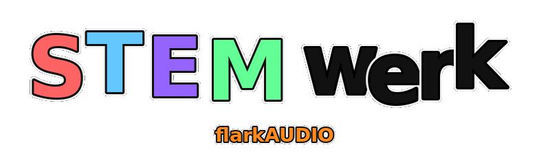
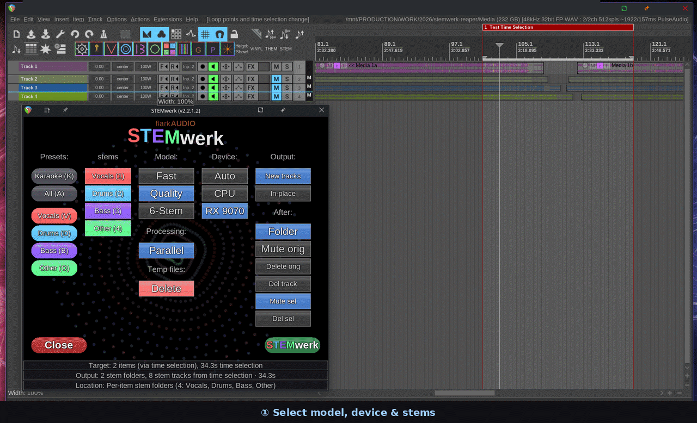

<p align="center">
	
</p>

Local-first stem separation inside REAPER (open source, ReaPack).<br>
Split vocals, drums, bass, and more directly in your DAW for practical production, editing, remix, and karaoke workflows.

## What is STEMwerk-reaper?
STEMwerk-reaper is a REAPER script that runs high-quality stem separation on selected items or time selections and brings the results back into your project as new tracks or in-place takes. It uses a Python backend (audio-separator/Demucs) and keeps processing on your machine.

### Stable release note
This README describes the current public stable release, `v2.2.2.1`. Future development continues on separate branches, but the features documented here reflect the current stable release line.

`v2.2.2.1` is a stabilization and packaging release. Compared with older `2.2.1.x` builds, the `2.2.2.x` line includes a visual refresh with refined STEMwerk theme styling, better dark and light UI consistency, improved setup/progress/complete window presentation, and better multilingual layout fit.

#### What's new in v2.2.2.1
- **Windows installer hardening**: bootstrap improvements and reduced normal installer size (source/master toolbar PNGs excluded from the installed payload; runtime strips and singles are still included)
- **Progress/UI fixes**: fixed duplicate stage text (e.g. `Processing Processing`), improved cancel handling and status reporting, fixed i18n fallback text issues
- **Offline patch path expanded**: the offline patch installer now supports older existing installs, including v2.2.1.4 and v2.2.2.0-style setups
- **macOS/Linux torch pin**: bootstrap now pins `torch` and `torchaudio` to `2.5.1` to avoid a PyTorch 2.6+ Demucs model-loading failure (`weights_only` default change); existing venvs with `torch >= 2.6` are automatically rebuilt
- **Better diagnostics**: separation logs now include Python/torch/torchaudio/onnxruntime/device information to make support easier
- **Toolbar refresh**: updated toolbar setup assets and installer packaging

Release validation: Windows VM smoke PASS, Windows NVIDIA laptop smoke PASS (including Quality separation and cancel), Linux AMD sanity PASS.



## Features
- Stem separation for vocals, drums, bass, other (plus optional guitar/piano with 6-stem models)
- Time selection and per-item workflows for multi-item tracks
- New-tracks or in-place replacement as takes
- Presets for quick workflows (Karaoke, Instrumental, Drums Only, etc.)
- Batch and multi-track processing queue
- Device selection with CPU and GPU fallback
- Local-first processing with transparent logs

## Who is this for?
- Producers and remixers who need quick stems without leaving REAPER
- Editors and podcasters cleaning dialog or music beds
- Sound designers and educators building isolated parts
- Anyone who wants a fast, offline stem workflow

## Requirements
- 64-bit REAPER
- 64-bit Windows, Linux, or macOS
- Internet access is recommended for first-time setup, runtime/package installation, and first model download
- Enough free disk space for the runtime, package cache, temporary files, and model cache

Recommended free space:
- Windows standard/online installer: at least 8 GB free recommended during first setup
- Windows NVIDIA CUDA or Linux ROCm setups may need more because torch/runtime packages can be large
- Windows bundled installer includes Python + FFmpeg, but it may still need backend package and model downloads
- Large offline allmodels installers need additional free space for the installer itself, extracted runtime/model assets, cache, and output stems
- Additional space is still needed for downloaded models and separated stem files

## What the installer does
STEMwerk uses a Python runtime for separation. On first setup it may:

- create a dedicated Python virtual environment
- install backend/runtime packages
- verify FFmpeg
- download the selected model on first use

On Windows, the installer handles the runtime/bootstrap work outside REAPER.
On macOS and Linux, `STEMwerk-SETUP.lua` is the normal REAPER-side setup and repair entry point.

## Internet And Offline Use
For most users, internet is needed on first install for:

- runtime/bootstrap setup
- backend package installation
- first model download

After runtime setup is complete and your model is cached, normal separation is typically offline.

Windows release assets may also include bundled or offline-oriented installers for specific stable versions. The bundled installer includes Python + FFmpeg, but it can still require backend package or model downloads on first use. Large offline allmodels installers include more runtime/model assets and are hosted separately on Google Drive because they are too large for GitHub release assets.

You should still run `STEMwerk-SETUP.lua` when asked to verify or repair the runtime inside REAPER.

## Backend Support
Windows is the primary validated path for the `v2.2.2.1` release. macOS and Linux receive backend dependency hardening in this release.

### CPU
- Windows: validated, including CPU/VM setups
- macOS Intel: validated
- Linux: supported

### Windows GPU
- NVIDIA: CUDA validated on `v2.2.2.1`
- AMD / Intel GPU: DirectML route (`torch-directml` + `onnxruntime-directml`), validated on Windows AMD

### Linux GPU
- NVIDIA: CUDA validated on RTX 3060 Laptop GPU when compatible drivers and PyTorch packages are available
- AMD: ROCm validated on RX 9070; ROCm remains dependent on supported hardware/driver combinations
- Not all AMD GPUs that work on Windows DirectML are supported on Linux ROCm

### Apple Silicon
- CPU is supported
- Platform-specific acceleration should be treated as best-effort; Apple Silicon reports are welcome

## Downloads

### Which installer should I use?
- **New Windows users**: use `STEMwerk-Setup-2.2.2.1.exe` — the standard online installer
- **Windows users who want embedded Python + FFmpeg**: use `STEMwerk-Setup-2.2.2.1-bundled.exe`
- **Existing Windows users updating from a previous install**: use `STEMwerk-Setup-2.2.2.1-offline-patch.exe` — supports v2.2.1.4 and v2.2.2.0-style installs
- **Fully offline Windows users who need all models pre-bundled**: use the Google Drive allmodels installers below
- **Linux users**: use the AppImage, `.deb`, or `.rpm` package
- **ReaPack users (Windows, Linux, macOS)**: update through ReaPack as usual, then run STEMwerk setup/repair in REAPER if the backend runtime needs checking or rebuilding

### GitHub release assets (v2.2.2.1)

| File | Description | Size |
|---|---|---:|
| `STEMwerk-Setup-2.2.2.1.exe` | Windows standard installer | 3.33 MB |
| `STEMwerk-Setup-2.2.2.1-bundled.exe` | Windows bundled installer (Python + FFmpeg included) | 133 MB |
| `STEMwerk-Setup-2.2.2.1-offline-patch.exe` | Windows offline patch/update helper | 3.42 MB |
| `STEMwerk-v2.2.2.1-Linux-x86_64.AppImage` | Linux portable build | 15.96 MB |
| `STEMwerk-v2.2.2.1-Linux-amd64.deb` | Debian/Ubuntu package | 15.64 MB |
| `STEMwerk-v2.2.2.1-Linux-x86_64.rpm` | RPM package | 15.67 MB |

GitHub also provides automatic source archives (`.zip` / `.tar.gz`) on the release page, but those are not the recommended end-user installer download.

### Large offline allmodels installers (Google Drive)
These are fully offline Windows installers that include all runtime packages and models. They are hosted on Google Drive because they are too large for GitHub release assets.

| File | Target | Size | Download |
|---|---|---:|---|
| `STEMwerk-Setup-2.2.2.1-offline-bundled-cpu-allmodels.exe` | Windows CPU | 871.3 MB | [Google Drive](https://drive.google.com/file/d/1wIvR8QFKxAYANoSjhjdq45MjBXZjQRS_/view?usp=drive_link) |
| `STEMwerk-Setup-2.2.2.1-offline-bundled-amd-gpu-allmodels.exe` | Windows AMD GPU / DirectML | 903.7 MB | [Google Drive](https://drive.google.com/file/d/1e_FZ276MEyRsQ-SmrV7PRBw43wLscAHC/view?usp=drive_link) |
| `STEMwerk-Setup-2.2.2.1-offline-bundled-nvidia-gpu-allmodels.exe` | Windows NVIDIA GPU / CUDA | 3.13 GB | [Google Drive](https://drive.google.com/file/d/1mdppCx0qDCkv7dXII_T_sYGTUTf0yHTt/view?usp=drive_link) |

### First-use model downloads
If models are not already included in your installer, approximate download sizes on first use:
- `Fast` (`htdemucs`): about 84 MB
- `Quality` (`htdemucs_ft`): about 337 MB
- `6-Stem` (`htdemucs_6s`): about 55 MB

Model size is separate from runtime/bootstrap size, and model download size is not a direct indicator of how many stems a model outputs.

## Windows Notes
- The installer is the recommended setup path on Windows.
- ReaPack is not recommended for first-time Windows setup because it installs scripts only, not the full runtime.
- During first-time setup, installer steps can appear paused for several minutes while Python/backend packages are resolved.
- For `v2.2.2.1`, offline or bundled users may also use the offline patch installer path when appropriate.
- `STEMwerk-SETUP.lua` is a REAPER-side verify/repair tool. It does not replace the Windows installer bootstrap path.

### Updating from older Windows installs
- If you already use an older bundled or offline Windows install, `v2.2.2.1` is the current stable target.
- Prefer `STEMwerk-Setup-2.2.2.1-offline-patch.exe` when you want the smaller update path for an existing compatible install (supports v2.2.1.4 and v2.2.2.0-style setups).
- If that patch path is not appropriate for your current install state, use the full Windows installer for `v2.2.2.1` instead.
- Current stable release: [STEMwerk v2.2.2.1](https://github.com/flarkflarkflark/STEMwerk-reaper/releases/tag/v2.2.2.1).
- After any installer update, run `STEMwerk-SETUP.lua` once to verify paths/runtime state.
- If setup still reports missing runtime/bootstrap pieces, rerun the installer first, then rerun `STEMwerk-SETUP.lua`.

## Installation

### Recommended (Stable users)
1. Windows: use the current Windows installer release asset (`.exe`).
2. Linux/macOS: install via ReaPack (or manual install), then run `STEMwerk-SETUP.lua`.
3. Open REAPER and ensure `STEMwerk-SETUP.lua` and `STEMwerk.lua` are present in the Action List.
4. Run `STEMwerk-SETUP.lua` first when prompted (or after updates/repairs), then run `STEMwerk.lua`.

Notes:
- Windows installer flow is the canonical bootstrap path for stable Windows use.
- On Linux/macOS, `STEMwerk-SETUP.lua` is the normal in-REAPER setup/repair entry point.
- On Windows, if runtime/bootstrap is incomplete, rerun the installer first, then verify with `STEMwerk-SETUP.lua`.

### Manual / Developer (Advanced)
1. Install a supported 64-bit Python 3 version and ensure it is on your PATH.
2. Clone or download this repository.
3. In REAPER: Actions -> Show action list -> ReaScript: Load ReaScript...
4. Load and run `scripts/reaper/STEMwerk-SETUP.lua` for guided setup.
5. Then run `scripts/reaper/STEMwerk.lua`.

If REAPER cannot find your Python, the setup script lets you point to a specific interpreter.

### ReaPack
Import this repository URL into ReaPack:

```text
https://raw.githubusercontent.com/flarkflarkflark/STEMwerk-reaper/main/index.xml
```

To install or update:
1. In REAPER: `Extensions -> ReaPack -> Browse packages...`
2. Search for `STEMwerk` and install or update the package.
3. Apply/synchronize changes in REAPER.
4. Run `STEMwerk-SETUP.lua` in the Action List to verify or rebuild the backend runtime if needed.

To add the repository for the first time:
1. `Extensions -> ReaPack -> Import a repository`
2. Paste the URL above, then synchronize.

> **WARNING (Windows)**: ReaPack is not recommended for first-time Windows setup. On Windows, full setup is intentionally handled by the installer; the REAPER setup does not launch bootstrap installers. ReaPack installs only the scripts, so Python/FFmpeg/venv are often missing or resolve to unsupported Windows shim paths. Use the installer (recommended) or the manual developer install instead.

- ReaPack installs STEMwerk under `REAPER/Scripts/STEMwerk-reaper/`, the same folder layout used by the installers.
- Older ReaPack layouts are still accepted by the runtime scripts as a fallback, so existing installs keep working.
- After installing or updating via ReaPack, run `STEMwerk-SETUP.lua` once.

### REAPER Action List: which scripts to use
To avoid confusion, only these are meant for normal use:
- `STEMwerk: Setup` (`STEMwerk-SETUP.lua`) — use this for manual installs, ReaPack installs, and the normal bootstrap/repair flow on macOS/Linux.
- `STEMwerk: Main` (`STEMwerk.lua`) — the main UI.
- `STEMwerk: Karaoke`, `STEMwerk: Vocals Only`, `STEMwerk: Drums Only`, `STEMwerk: Bass Only`, `STEMwerk: All Stems` — optional presets.
- `Stemwerk: Explode Takes (In Place)` (`STEMwerk_Explode_Takes.lua`) — quick tool for selected multi-take items.

Internal/troubleshooting (not for regular use):
- everything under `scripts/reaper/_internal/` — runtime helpers used by the public scripts

Note: REAPER does not auto-register scripts in the Action List. Use Actions → ReaScript → Load ReaScript… or run `STEMwerk_Setup_Toolbar.lua` to register the standard actions.

### Toolbar icons (manual assign)
- STEMwerk ships a language-neutral icon pack under `scripts/reaper/assets/toolbar_icons/`.
- Recommended REAPER formats:
  - `strips_90x30/` for standard DPI toolbars (3-state strip: normal/hover/active)
  - `strips_180x60/` for hiDPI/retina toolbars
  - `single/` for custom/manual icon assignment sizes (24/30/36/48/64)
- Icons are optional and do not edit `reaper-menu.ini`; assign them manually in toolbar customize dialogs.

## First-run expectations
- First run can take a while: STEMwerk may need to create or verify its runtime, install backend packages, and download the selected model.
- Setup time depends on OS, backend path (CPU/GPU), internet speed, and package resolver speed.
- This is expected behavior for a first install or major update, not a normal "per-track" processing delay.

## Troubleshooting setup/runtime
- If setup fails or runtime looks incomplete, run `STEMwerk-SETUP.lua` to verify/repair the install.
- Check the STEMwerk logs shown by setup/runtime diagnostics to identify the failing step (Python, FFmpeg, backend package, model download, permissions, etc.).
- Backend behavior differs by system and drivers: CPU is the safest fallback, while CUDA/DirectML/ROCm availability depends on hardware and compatible packages.
- On Windows, if bootstrap/runtime files are missing, re-run the installer first, then verify with `STEMwerk-SETUP.lua`.
- If no stems are created and you need help, please provide: `bootstrap.log`, any available `separation_log.txt`, `stdout.txt`, and `stderr.txt`.
- NVIDIA offline bundled troubleshooting (related to issue #11):
  - If separation works online but fails offline, verify models are present in `%LOCALAPPDATA%\\STEMwerk\\models` and that the installed variant actually includes the model set you selected.
  - Re-run the matching offline bundled installer variant (for example `STEMwerk-Setup-2.2.2.1-offline-bundled-nvidia-gpu-allmodels.exe`) and test once with internet disabled to confirm the offline path.
  - Bundled/offline installers intentionally disable the pre-setup "cleanup models" task to avoid deleting freshly bundled model payloads.

## REAPER workflows
- New tracks: Create dedicated stem tracks, optionally grouped in a folder
- In-place: Replace the source item with stems as takes
- Time selection: Process only the selected region, even without a selected item
- Per-item: Multi-item tracks can be processed item-by-item for cleaner naming
- Quick presets: Optional toolbar scripts for one-click workflows

## GUI highlights
- Main dialog: stem toggles, presets, in-place vs new tracks, model choice, and device selector.
- Progress window: per-job status, realtime stages/ETA, sequential/parallel indicator with fallback reason.
- Visuals: optional procedural art gallery and audio-reactive visuals (toggleable).
- Shortcuts: quick stem toggles (1-4), presets (K/I/D), Enter to start, Esc to cancel.
- Language support: provisional three-language UI (EN/NL/DE).
- Theme: day/night mode (light/dark) with persistent settings.

## Parallel vs Sequential (Multi-track)
Parallel mode is used when `Parallel` is enabled. Sequential mode is used when `Parallel` is disabled.

When `Parallel` is enabled and multiple jobs are queued, STEMwerk still forces Sequential in these cases:
- Explicit `DirectML` device selection on multi-job runs (Windows stability safeguard).
- `device = auto` with no detected GPU backend (`Auto device, no GPU`).

If those safeguards do not apply, both per-track and per-item multi-job queues can run in parallel.

Examples where parallel runs:
- 3 tracks queued, `Parallel` on, device = `cuda:0` -> jobs run in parallel.
- Multiple selected items across tracks, no time selection, `Parallel` on, device = `cuda` -> per-item jobs run in parallel.
- `device = auto` with a detected GPU backend and multiple queued jobs -> parallel.

Examples where sequential is used:
- `Parallel` is switched off by the user.
- Explicit `DirectML` with multiple queued jobs -> sequential (`DirectML multi-track stability mode`).
- `Parallel` on + `device = auto` with no detected GPU backend -> sequential (`Auto device, no GPU`).

The progress window shows the active mode and, when applicable, the forced-sequential reason.

## Relationship to STEMwerk-core
STEMwerk-reaper bundles the same separation pipeline used by STEMwerk-core via `scripts/reaper/audio_separator_process.py` and the `tools/` utilities. The REAPER layer handles DAW integration, UI, and item or track management, while the core handles model execution and device selection.

See `docs/ROCm.md` for Linux AMD guidance.

## Development / advanced setup
- Python tooling lives in `tools/` and `scripts/reaper/audio_separator_process.py`
- Helpers include `tools/gpu_check.py`, `tools/warmup.py`, and `tools/stress_bench.py`
- Requirements are listed in `requirements-ci.txt` and `requirements-gui.txt`
- Tests and fixtures live under `tests/`

## Versioning
Single source of truth: `VERSION`.
Before tagging/releases:
1. Update `VERSION`
2. Run `python tools/version_sync.py --write`
3. Commit the changes
4. Tag `vX.Y.Z` to match `VERSION`

## Credits
3D artwork collection inspired by / derived from Milkdrop presets.

## License / author
MIT License.
Author: flarkAUDIO (flarkaudio@pm.me)
